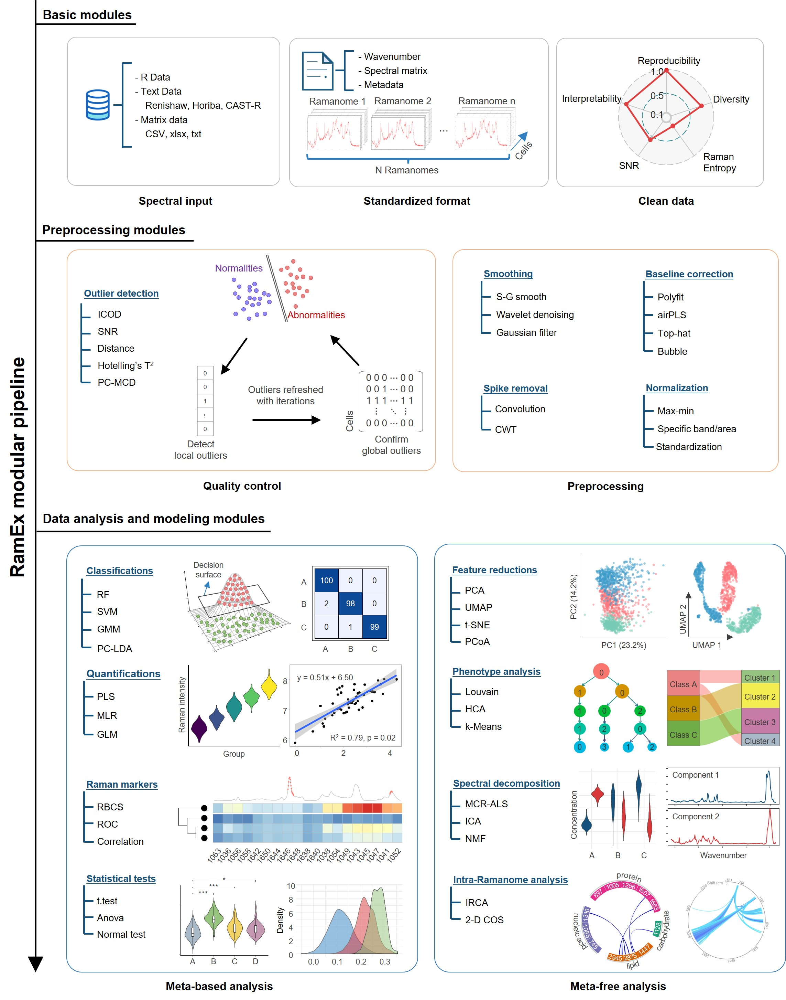

<p align="center">
  <a href="https://github.com/qibebt-bioinfo/RamEx">
    
  </a>
</p>

## *RamEx*: An R package for high-throughput microbial ramanome analyses with accurate quality assessment

## Key features


- **Reliability** achieved via stringent statistical control
- **Robustness** achieved via flexible modelling of the data and automatic parameter selection
- **Reproducibility** promoted by thorough recording of all analysis steps
- **Ease of use**: high degree of automation, an analysis can be set up in several mouse clicks, no bioinformatics expertise required
- **Powerful tuning options** to enable unconventional experiments
- **Scalability and speed**: up to 100 runs processed per minutes

**Download**: https://github.com/qibebt-bioinfo/RamEx


### Table of Contents
**[Installation](#installation)**<br>
**[Getting started](#getting-started)**<br>
**[Raw data formats](#raw-data-formats)**<br>
**[Output](#output)**<br>
**[Changing default settings](#changing-default-settings)**<br>
**[Visualisation](#visualisation)**<br>
**[Frequently asked questions (FAQ)](#frequently-asked-questions)**<br>
**[Contact](#contact)**<br>

### Installation

RamEx will be installed from GitHub:.
```{r}
library('devtools')
install_github("qibebt-bioinfo/RamEx")
```

### Getting Started
#### Data Loading
Raman spectra are respectively tracked in single txt files, and their meta info is recorded in the file name.
```{r}
library(RamEx)
library(dplyr)
data(RamEx_data)
# Test a local data
RamEx_data <- read.spec('dir_path/to/your/data')
```
#### Pretreatment
Spectral pretreatment will make the spectrum clearer, containing smoothing, baseline removal, normalization and truncation.
Mean spectra will display their effects.
Here the results of each step will be kept in the Ramanome for better debugging, and 'plot' exhibit the final dataset.
```{r}
RamEx_data <- RamEx_data %>% Preprocessing.Smooth.Sg %>% Preprocessing.Baseline.Polyfit %>% Preprocessing.Normalize(.,'ch') 
plot(RamEx_data)  
```
#### Quality control
Remove the samples with low quality or abnormal spectral acquisition. ICOD method is recommended to perform quality control (QC). Each method will return a logical vector, indicating the quality of each cell sample.
```{r}
qc_icod <- Qualitycontrol.ICOD(RamEx_data)
data_cleaned <- RamEx_data[qc_icod$quality,] 
plot(data_cleaned)
qc_mcd <- Qualitycontrol.Mcd(RamEx_data) 
qc_t2 <- Qualitycontrol.T2(RamEx_data) 
qc_dis <- Qualitycontrol.Dis(RamEx_data) 
qc_snr <- Qualitycontrol.Snr(RamEx_data, 'easy')
```

#### Interested Bands
Get single-cell intensitiy or intensity accumulationy within a wavenumber range, pls give a list containing multiple bands or band ranges. These feature selection results will be saved as 'interested.bands' in the given Ramanome object. Further, you can add some equations by yourself (e.g. calculate CDR). 
```{r}
data_cleaned <- Feature.Reduction.Intensity(data_cleaned, list(c(2000,2250),c(2750,3050), 1450, 1665))
# calculate CDR
CDR <- data.frame(data_cleaned@meta.data, 
                  data_cleaned$`2000~2250`/(data_cleaned$`2000~2250` + data_cleaned$`2750~3050`))
```

#### Reduction
Nonlinear methods, such as UMAP and t-SNE. Linear methods like PCA, pCoA. The reduced sample matrix will be contained in the Ramanome onject as 'reductions'. Attention: A pre-treatment of large spectral matrix by PCA is recommended, since UMAP and t-SNE are highly complex algorithms.
```{r}
data.reduction <- Feature.Reduction.Pca(data_cleaned) %>% Feature.Reduction.Pcoa %>% Feature.Reduction.Tsne %>% Feature.Reduction.Umap
``` 

#### Markers analysis
RamEx provides three types of markers analysis: ROC, correlation and RBCS. 
In addition to singular Raman markers, paired bands are also examined
```{r}
ROC_markers <- Raman.Markers.Roc(Preprocessing.Cutoff(data_cleaned, 1400, 1500), paired  = TRUE, threshold = 0.6) 
cor_markers <- Raman.Markers.Correlations(Preprocessing.Cutoff(data_cleaned, 1400, 1500), min.cor = 0.6) 
RBCS.markers <- Raman.Markers.Rbcs(data_cleaned, threshold = 0.003, show = T) 
```
#### IRCA
Observe the single-cell heterogeneity within the Ramanome/microbial community and to elucidate intracellular metabolite conversions.
- Global IRCA.
```{r}
IRCA.interests <- Intraramanome.Analysis.Irca.Global(data_cleaned)
```
- Local IRCA
```{r}
bands_ann <- data.frame(
  Wave_num = c(742,850,872,971,997,1098,1293,1328,1426,1576,
               824,883,1005,1033,1051,1237,1559,1651,
               1076,1119,1370,2834,2866,2912),
  Group = rep(c('Nucleic acid', 'Protein', 'Lipids'), times = c(10, 8, 6)) )
Intraramanome.Analysis.Irca.Local(data_cleaned, bands_ann = bands_ann)
```
- 2D-COS 
Captures both synchronous (simultaneous changes) and asynchronous (sequential changes) relationships, providing detailed insights into spectral changes
```{r}
data_cos <- Intraramanome.Analysis.2Dcos(data_cleaned) 
```
#### Phenotype analysis
RamEx provides four types of phenotype analysis: Louvain clustering, K-means clustering, Gaussian mixture model and hierarchical clustering.
```{r}
clusters_louvain <- Phenotype.Analysis.Louvaincluster(object = data_cleaned, resolutions = c(0.8)) 
clusters_kmneans <- Phenotype.Analysis.Kmeans(data_cleaned,5)
clusters_hca <- Phenotype.Analysis.Hca(data_cleaned)
clusters_gmm <- Phenotype.Analysis.Gmm(data_cleaned)
```

#### Classifications
Linear Discriminant Analysis (LDA), Random Forest (RF), Support Vector Machine (SVM)
```{r}
model.lda <- Classification.Lda(data_cleaned)
model.rf <- Classification.Rf(data_cleaned)
model.svm <- Classification.Svm(data_cleaned)
# when new data is available, you can use the following code to predict the new data by using the trained model.
pred_new <- predict_classification(model.lda, data_cleaned)
```
#### Quantifications
Partial Least Squares (PLS), Multiple Linear Regression (MLR), Generalized Linear Model (GLM)
```{r}
quan_pls <- Quantification.Pls(data_cleaned) 
quan_mlr <- Quantification.Mlr(data_cleaned) 
quan_glm <- Quantification.Glm(data_cleaned) 
# when new data is available, you can use the following code to predict the new data by using the trained model.
pred_new <- predict_quantification(quan_pls, data_cleaned)
```

#### Spectral decomposition
Multiple Component Regression - Alternating Least Squares (MCR-ALS), Independent Component Analysis (ICA), Non-negative Matrix Factorization (NMF) are provide to decompose the spectral matrix into multiple components.
```{r}
decom_mcr <- Spectral.Decomposition.Mcrals(data_cleaned,n_comp = 2)
decom_ica <- Spectral.Decomposition.Ica(data_cleaned, n_comp = 2) 
decom_nmf <- Spectral.Decomposition.Nmf(data_cleaned, n_comp = 2) 
```
### Raw data formats

It accommodates data from mainstream instrument manufactures such as Horiba, Renishaw, Thermo Fisher Scientific, WITec, and Bruker. This module efficiently manages single-point data collection, where each spectrum is stored in a separate txt file, as well as mapping data enriched with coordinate information. 

### Output

The **Output** pane allows to specify where the output should be saved. 

### Changing default settings
RamEx can be successfully used to process almost any experiment with default settings. In general, it is recommended to only change settings when specifically advised to help information.


### Visualisation
RamEx also offers an online version. Please visit (http://ramex.single-cell.cn).


### Frequently asked questions
**Q: Why RamEx?**  
**A:** Raman spectroscopy, with its fast, label-free, and non-destructive nature, is increasingly popular for capturing vibrational energy levels and metabolic differences in cells, providing qualitative and quantitative insights at single-cell or subcellular resolutions. Leveraging the extensive information provided by the complex and high-dimensional nature of Ramanome, we developed RamEx, an R package designed to adeptly manage extensive Raman datasets generated by a wide range of devices and instruments. It features: 1) a dynamic outlier detection algorithm that operates without prior knowledge or fixed criteria; 2) optimized clustering and marker identification algorithms tailored to the unique properties of high dimensional, colinear and nonlinear Raman spectra; 3 ) a unified computational framework with tools and pipelines for key Raman tasks such as cell type/species identification, clusteringphenotypic analysis, and antibiotic resistance detectionmolecular composition analysis; 4) enhanced processing of large-scale datasets through C++ optimization and GPU computing; 5) a standardized Raman dataset format with integrated metadata and evaluation metrics; and 6) a graphical user-interface (GUI) for intuitive data visualization and interaction.

**Q: How to use RamEx?**  
**A:** Here the [Getting Started](#getting-started) section provides a step-by-step guide on how to use RamEx, which could be downloaded from [RamEx.Rmd](doc/RamEx.html?raw=true). More details and examples could be found in the [article](https://doi.org/10.1101/2025.03.10.642505) and the paper reproducibility for [community analysis](https://www.scidb.cn/en/file?fid=554f1d6b09ee9c606087c8094909b46e&mode=preview). Further user documentation are under construction.

**Q: How to install OpenCL?**  
**A:** RamEx relies on OpenCL for GPU acceleration. If you encounter issues with OpenCL installation or configuration, please refer to the following additional resources:
- Linux:
  - Ensure you have the latest drivers for your GPU.
  - For more information on OpenCL on Linux, refer to the [POCL documentation](https://github.com/pocl/pocl).
- Windows:
  - Intel and AMD provide detailed installation guides for their OpenCL SDKs. Follow the instructions specific to your hardware:
    - [Intel OpenCL SDK](https://www.intel.com/content/www/us/en/developer/tools/opencl-sdk.html)
    - [AMD OpenCL SDK](https://github.com/GPUOpen-LibrariesAndSDKs/OCL-SDK/releases)
- macOS:
  - macOS users can leverage Homebrew for a seamless installation experience also refer to the [POCL documentation](https://github.com/pocl/pocl).
If you still face issues, please consider reaching out to the respective SDK support forums or the [OpenCL community](https://www.khronos.org/opencl/).


### Key papers 
**RamEx**   
Zhang Y., Jing G., ..., Xu J., Sun L., 2025. [RamEx: An R package for high-throughput microbial ramanome analyses with accurate quality assessment](https://doi.org/10.1101/2025.03.10.642505). *bioRxiv* 


**IRCA**   
He Y., Huang S., Zhang P., Ji Y., Xu J., 2021. [Intra-Ramanome Correlation Analysis Unveils Metabolite Conversion Network from an Isogenic Population of Cells](https://doi.org/10.1128/mbio.01470-21). *mBio* 

**RBCS**  
Teng L., ...,  Huang W.E., Xu J., 2016. [Label-free, rapid and quantitative phenotyping of stress response in e. coli via ramanome](https://www.nature.com/articles/srep34359.pdf). *Scientific Reports* 


### Contact
Please post any questions, feedback, comments or suggestions on the [GitHub Discussion board](https://github.com/qibebt-bioinfo) (alternatively can create a GitHub issue) or email SCC.
